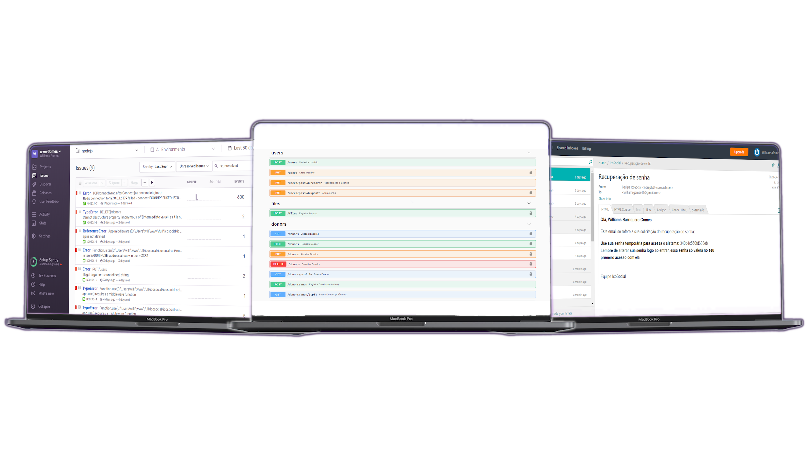

<h1 align="center">
    
</h1>

<h4 align="center">
  <strong>RESTful API</strong>
</h4>

 

  

  <a href="#floppy_disk-technology">Technology</a>&nbsp;&nbsp;&nbsp;|&nbsp;&nbsp;&nbsp;
  <a href="#computer-project">Project</a>&nbsp;&nbsp;&nbsp;|&nbsp;&nbsp;&nbsp;
  <a href="#books-documentation">Documentation</a>&nbsp;&nbsp;&nbsp;|&nbsp;&nbsp;&nbsp;
  <a href="#family_man_man_boy_boy-contribute">Contribute</a>&nbsp;&nbsp;&nbsp;|&nbsp;&nbsp;&nbsp;
  <a href="#memo-license">License</a>&nbsp;&nbsp;&nbsp;|&nbsp;&nbsp;&nbsp;
  <a href="#blue_heart-contributors">Contributors</a>

 

<strong>Icósocial</strong> is an NGO (non-governmental organization) that helps people (children and their guardians) by offering language, sports and other classes.

## :floppy_disk: Technology

This project was developed with the following technologies:

<ul>
  <li><a href="https://nodejs.org/en/">Node.js</a></li>
  <li><a href="https://www.mongodb.com/">Mongo</a></li>
  <li><a href="https://redis.io/">Redis</a></li>
  <li><a href="http://sentry.io/">Sentry</a></li>
  <li><a href="https://swagger.io/">Swagger</a></li>
</ul>

## :computer: Project

This project is part of the NGO Eco Social.

This is the RESTful API that is responsible for the business layer of the application.

##### 🔢 Commands

#### **`yarn dev`** 
>Run the project under development using the nodemon.

#### **`yarn dev:debug`** 
> Run the project under development with debug.

#### **`yarn dev:queue`** 
> Runs queue in development.

#### **`yarn test`** 
> Run tests.

#### **`yarn build`**
> Build the application.

#### **`yarn start`**
> Run the application in production. You need to run the **`yarn build`** command first.

#### **`yarn queue`**
> Executes the application queue in production. You need to run the **`yarn build`** command first.

## :books: Documentation

See the API documentation [here](http://157.245.216.89/api/v1/docs/).

## :family_man_man_boy_boy: Contribute

To contribute, <a href="CONTRIBUTING.md">follow these instructions</a>.

## :memo: License

This project is under the MIT license. See the file <a href="LICENSE.md">LICENSE</a> for more details.

## :blue_heart: Contributors

<table>
  <tr>
    <td align="center" style="border: none;">
      <a href="https://github.com/wwwgomes">
        
         
        
          <b>Williams Gomes</b>
        
      </a>
       
      
<scan title="Code">💻</scan>|<scan title="Documentation">📖</scan>|<scan title="Bugs">🐛</scan>

    </td>
  </tr>
</table>

---
